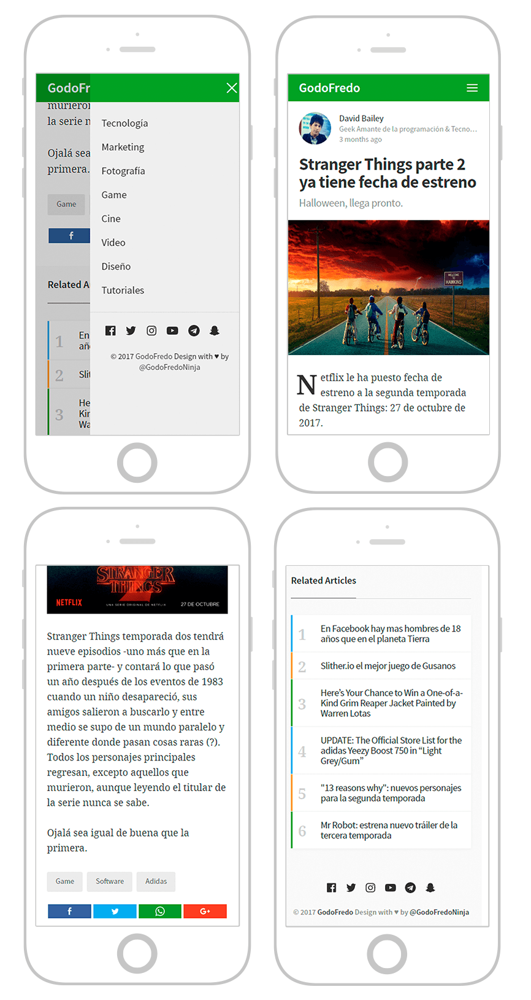

# Hodor AMP for [Ghost](https://github.com/tryghost/ghost/)

> If you have any suggestions to improve the theme,  you can send me a tweet [@GodoFredoNinja](https://goo.gl/y3aivK)

## ❤ Please, help me with a small donation on [Paypal](https://bit.ly/PayPal-GodoFredoNinja). It'll help motivate me to update the theme with many improvements.

[](https://bit.ly/PayPal-GodoFredoNinja)



## Featured

- Navigation
- links to followers in social media
- Tags
- Related Articles (6 articles)
- Buttons to share the article (Facebook - Twitter - Google + - Whatsapp)
- YouTube, Vimeo, kickstarter, Facebook, dailymotion => Responsive

## How to use?

is very easy to use, you just have to copy `amp.hbs` and  `partials` in your ghost theme

## Change theme color

edit on line 17 add your favorite color in `.u-bgColor {background-color: # 00a034}`

```hbs
<style amp-custom>.u-bgColor{background-color:Add_your_favorite_color}{{> "amp/amp-styles"}}</style>

```

## Add links to your Social Media

— you need to edit the following file `partials/amp/amp-sidebar`

```hbs
{{!-- Instagram --}}
<a href="" rel="nofollow" target="_blank">{{> "amp/icon-instagram"}}</a>

{{!-- Youtube  --}}
<a href="" rel="nofollow" target="_blank">{{> "amp/icon-youtube"}}</a>

{{!-- Telegram --}}
<a href="" rel="nofollow" target="_blank">{{> "amp/icon-telegram"}}</a>

{{!-- SnapChap  --}}
<a href="" rel="nofollow" target="_blank">{{> "amp/icon-snapchap"}}</a>
```